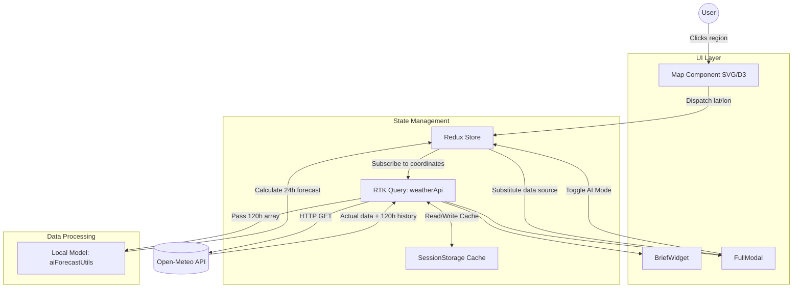
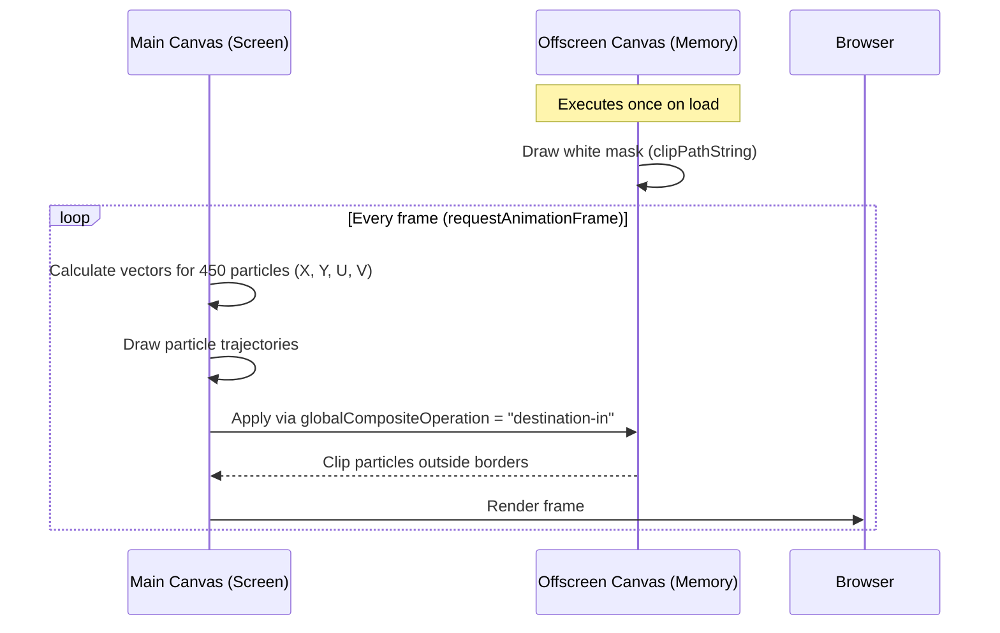
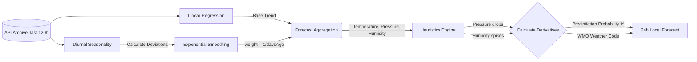

# Weather Forecast

This project is a client-side web application for meteorological data analysis. The primary architectural goal was to shift heavy computational loads—such as vector field animation and mathematical weather forecasting—directly to the client browser. It is built with React 19 and bundled via Vite.

## System Architecture and Data Flow

Component interaction revolves around Redux Toolkit global state and the RTK Query caching layer. We avoided using local component states for weather data to prevent duplicate network requests when switching between widgets and modals.

## Rendering Subsystem (D3.js + Canvas)

The map rendering is split into two layers: a static SVG for handling polygon click events and a Canvas for drawing the wind particle flow.

Our biggest performance bottleneck during development was mobile devices (specifically Safari on iOS). Calling the `clip()` method to constrain 450 moving particles strictly within the country borders on every frame (60 FPS) overloaded the main thread.

**The Offscreen Canvas Solution:**
We moved the mask generation to a separate canvas that exists only in memory.

Additionally, the animated cloud background (`App.module.css`) relies solely on `transform: translate3d` and `will-change`. We intentionally removed `box-shadow` and `filter: blur`, replacing them with geometric `::before` and `::after` pseudo-elements. This forces the browser to delegate layer rendering to the GPU.

## Forecasting Mathematical Model (AI Mode)

The algorithm in `utils/aiForecastUtils.js` generates forecasts without requesting data from a backend. It is not a neural network, but a mathematical model utilizing linear regression and exponential smoothing.

**How the algorithm works:**

1. **Global Trend:** `regression.js` calculates a straight trend line using the Ordinary Least Squares method for each parameter.
2. **Seasonality:** Linear regression ignores daily cycles (nights are colder than days). To compensate, the script calculates the difference between the trend line and the actual data at the _exact same hour coordinate_ on previous days.
3. **Weights:** We apply the formula `weight = 1 / daysAgo`. A deviation from the trend recorded yesterday (weight 1) contributes more heavily to the forecast than data from five days ago (weight 0.2).
4. **Derivatives:** Derived parameters like precipitation probability are calculated via physics-based `if/else` logic (e.g., high humidity + rapid pressure drop = rain).

The model has limitations and can miscalculate during sudden atmospheric front shifts, but it handles inertial weather changes reliably.
