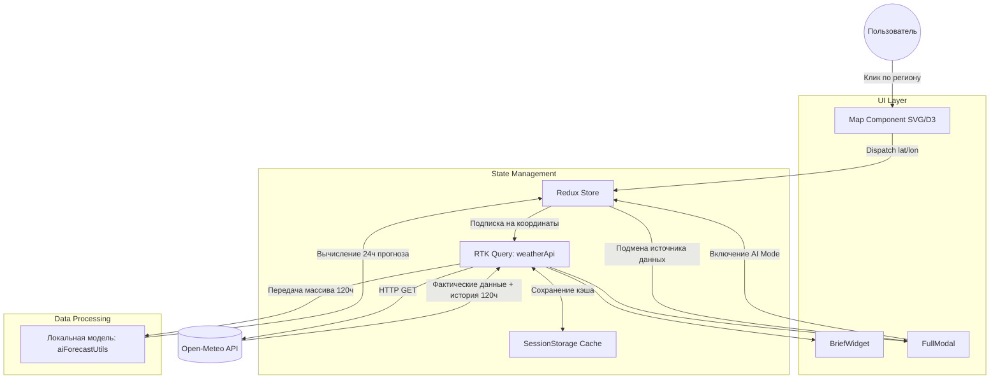
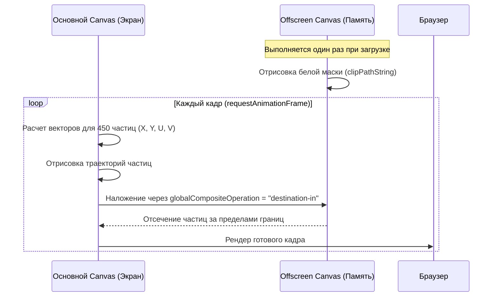
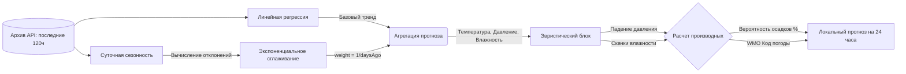

# Weather Forecast

Проект представляет собой клиентское веб-приложение для анализа метеорологических данных. Основной упор сделан на перенос вычислительной нагрузки (анимация векторных полей, математическое прогнозирование) на сторону клиента. Приложение написано на React 19 и собирается через Vite.

## Архитектура системы и поток данных

Взаимодействие компонентов построено вокруг глобального состояния Redux Toolkit и кэширующего слоя RTK Query. Мы отказались от локальных стейтов для хранения метеоданных, чтобы не дублировать запросы при переключении между виджетами и модальными окнами.

## Подсистема рендеринга (D3.js + Canvas)

Отрисовка карты разделена на два слоя: статический SVG для обработки кликов по полигонам регионов и Canvas для отрисовки потока ветра.

Самой большой проблемой при разработке была производительность на мобильных устройствах (особенно в Safari на iOS). Вызов метода `clip()` для обрезки 450 движущихся частиц строго по границам страны каждый кадр (60 FPS) перегружал основной поток.

**Решение с Offscreen Canvas:**
Мы вынесли маску в отдельный холст, который существует только в памяти.

Дополнительно, анимированный фон с облаками (`App.module.css`) использует только свойства `transform: translate3d` и `will-change`. Мы намеренно отказались от `box-shadow` и `filter: blur`, заменив их геометрическими псевдоэлементами `::before` и `::after`, чтобы браузер мог вынести отрисовку слоев на GPU.

## Математическая модель прогнозирования (AI Mode)

Алгоритм в `utils/aiForecastUtils.js` генерирует прогноз без обращения к бэкенду. Это не нейросеть, а математическая модель, использующая линейную регрессию и экспоненциальное сглаживание.

**Как работает алгоритм:**

1. **Глобальный тренд:** `regression.js` строит прямую линию тренда по методу наименьших квадратов для каждого параметра.
2. **Сезонность:** Линейная регрессия игнорирует суточные циклы (ночью холоднее, чем днем). Чтобы это компенсировать, скрипт находит разницу между линией тренда и реальными данными в _ту же самую координату часа_ в предыдущие дни.
3. **Веса:** Применяется формула `weight = 1 / daysAgo`. Отклонение от тренда, зафиксированное вчера (вес 1), вносит больший вклад в прогноз, чем данные пятидневной давности (вес 0.2).
4. **Производные:** Параметры вроде вероятности осадков считаются правилами `if/else` на основе физики (например, высокая влажность + резкое падение давления = дождь).

Модель имеет ограничения и может ошибаться при резкой смене атмосферных фронтов, но хорошо справляется с предсказанием инерционных погодных изменений.
