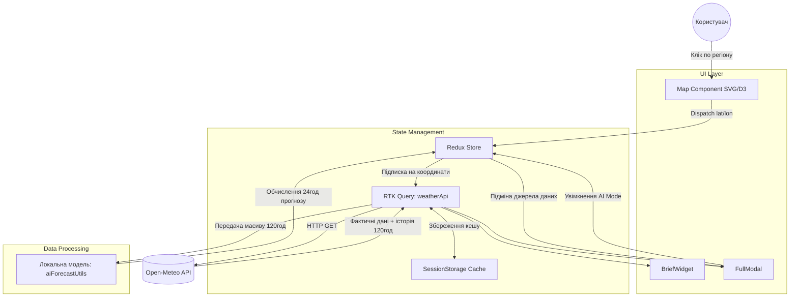
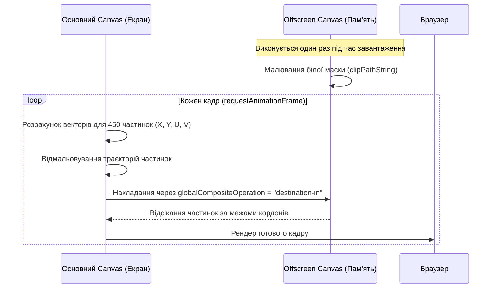
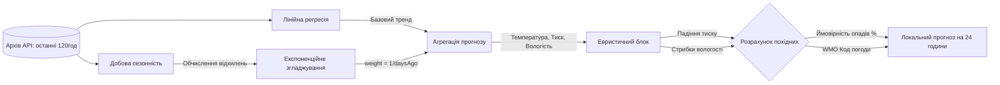

# Weather Forecast

Проєкт є клієнтським веб-застосунком для аналізу метеорологічних даних. Головний акцент зроблено на перенесення обчислювального навантаження (анімація векторних полів, математичне прогнозування) на сторону клієнта. Застосунок написано на React 19, збірка виконується через Vite.

## Архітектура системи та потік даних

Взаємодію компонентів побудовано навколо глобального стану Redux Toolkit та шару кешування RTK Query. Ми відмовилися від локальних стейтів для зберігання метеоданих, щоб не дублювати запити під час перемикання між віджетами та модальними вікнами.

## Підсистема рендерингу (D3.js + Canvas)

Відмальовування карти розділено на два шари: статичний SVG для обробки кліків по полігонах регіонів та Canvas для рендерингу потоку вітру.

Найбільшою проблемою під час розробки була продуктивність на мобільних пристроях (особливо в Safari на iOS). Виклик методу `clip()` для обрізання 450 рухомих частинок строго по межах країни кожен кадр (60 FPS) перевантажував основний потік.

**Рішення з Offscreen Canvas:**
Ми винесли маску в окреме полотно, яке існує лише в пам'яті.

Додатково, анімований фон із хмарами (`App.module.css`) використовує лише властивості `transform: translate3d` та `will-change`. Ми навмисно відмовилися від `box-shadow` та `filter: blur`, замінивши їх геометричними псевдоелементами `::before` та `::after`, щоб браузер міг винести відмальовування шарів на GPU.

## Математична модель прогнозування (AI Mode)

Алгоритм у `utils/aiForecastUtils.js` генерує прогноз без звернення до бекенду. Це не нейромережа, а математична модель, що використовує лінійну регресію та експоненційне згладжування.

**Як працює алгоритм:**

1. **Глобальний тренд:** `regression.js` будує пряму лінію тренду за методом найменших квадратів для кожного параметра.
2. **Сезонність:** Лінійна регресія ігнорує добові цикли (вночі холодніше, ніж вдень). Щоб це компенсувати, скрипт знаходить різницю між лінією тренду та реальними даними в _ту ж саму координату години_ у попередні дні.
3. **Ваги:** Застосовується формула `weight = 1 / daysAgo`. Відхилення від тренду, зафіксоване вчора (вага 1), вносить більший вклад у прогноз, ніж дані п'ятиденної давності (вага 0.2).
4. **Похідні:** Параметри на кшталт ймовірності опадів рахуються правилами `if/else` на основі фізики (наприклад, висока вологість + різке падіння тиску = дощ).

Модель має обмеження і може помилятися під час різкої зміни атмосферних фронтів, але добре справляється з передбаченням інерційних погодних змін.
